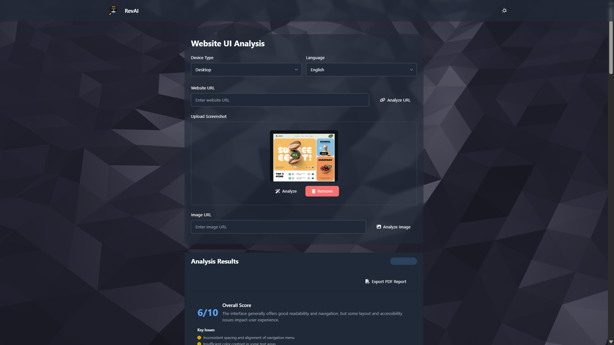
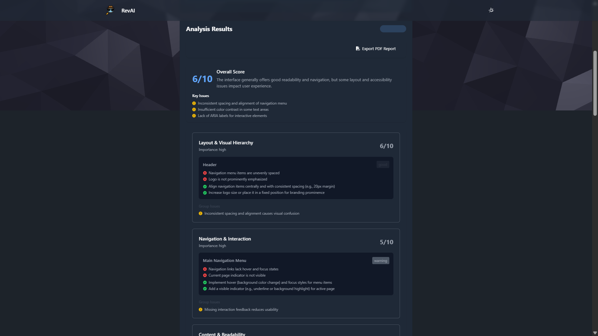
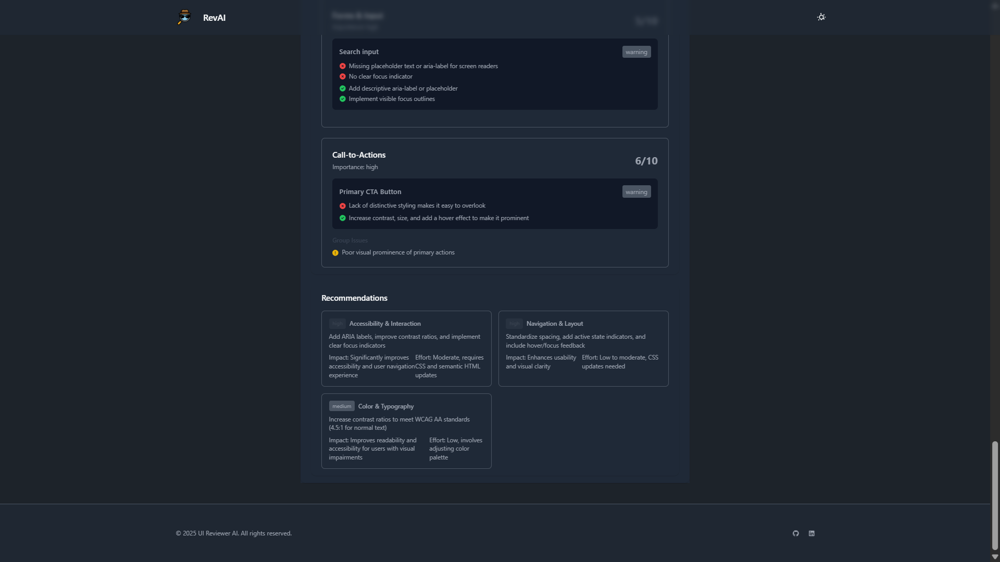

# 🔍 RevAI - Website UI/UX Review Assistant

A modern AI-powered web application that reviews any website or UI design and generates a detailed breakdown of usability, visual hierarchy, accessibility, layout consistency, and improvement suggestions.  
Built with responsive UI and support for both **light & dark themes**.

---

## 📸 Screenshots

| Feature | Preview |
|--------|---------|
| Hero Section |  |
| UI Analysis Results |  |
| Suggestions Panel |  |

---

## ✨ Key Highlights

- **Multiple Input Modes**
  - Analyze via Website URL  
  - Analyze via Image URL  
  - Screenshot Upload (Drag & Drop supported)

- **Smart AI Evaluation**
  - Layout & Design Consistency  
  - Color & Typography Evaluation  
  - Accessibility & Readability  
  - Performance & UI Structure Scoring  

- **User-Friendly Experience**
  - Auto Language Detection  
  - Device Mode Switch (Desktop/Mobile)  
  - Real-time Preview  
  - Saved States (URL state memory)

- **Theme Support**
  - 🔆 Light Mode  
  - 🌙 Dark Mode  

---

## 🛠️ Tech Stack

| Technology | Usage |
|-----------|--------|
| HTML5 | Structure |
| Tailwind CSS + DaisyUI | UI Styling |
| Font Awesome | Icons |
| JavaScript | Logic + State Management |
| RapidAPI | AI Analysis Backend |

---

## 🚀 Getting Started

### 1️⃣ Clone Repository
```bash
git clone https://github.com/smtkuo/ai-website-design-ui-ux-reviewer.git
cd ai-website-design-ui-ux-reviewer
